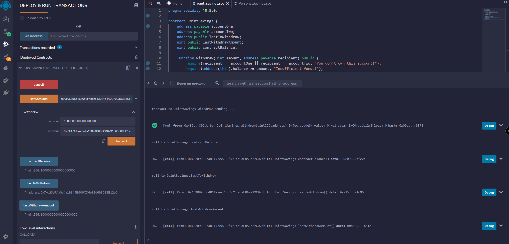

# Unit 20 - "Joint Savings Account"

### Background

A fintech startup company has recently hired you. This company is disrupting the finance industry with its own cross-border, Ethereum-compatible blockchain that connects financial institutions. Currently, the team is building smart contracts to automate many of the institutions’ financial processes and features, such as hosting joint savings accounts.

To automate the creation of joint savings accounts, you’ll create a Solidity smart contract that accepts two user addresses. These addresses will be able to control a joint savings account. Your smart contract will use ether management functions to implement a financial institution’s requirements for providing the features of the joint savings account. These features will consist of the ability to deposit and withdraw funds from the account.

### Files

[Joint Savings Smart Contract File](Starter_Code/joint_savings.sol)

[Folder with screenshots](Execution_Results)

### accountOne Address: 
0x0c0669Cd5e60a6F4b8ce437E4a4A007093D368Cb 
### accountTwo Address:
0x7A1f3dFAa0a4a19844B606CD6e91d693083B12c0

### Screenshots of contract deployment and interactions

* Note - for the last 2 withdraw transactions I took one screenshot for each one which showed the contractBalance, 
lastToWithdraw and the lastWithdrawAmount functions after I executed them, so I only have 6 pictures.

Transaction 1 - setAccounts:

Transaction 2 - deposit 1 Ether as Wei:

Transaction 3 - deposit 10 Ether as Wei:

Transaction 4 - deposit 5 Ether:

Transaction 5 - withdraw 5 Ether into accountOne:

Transaction 6 - withdraw 10 Ether into accountTwo:
